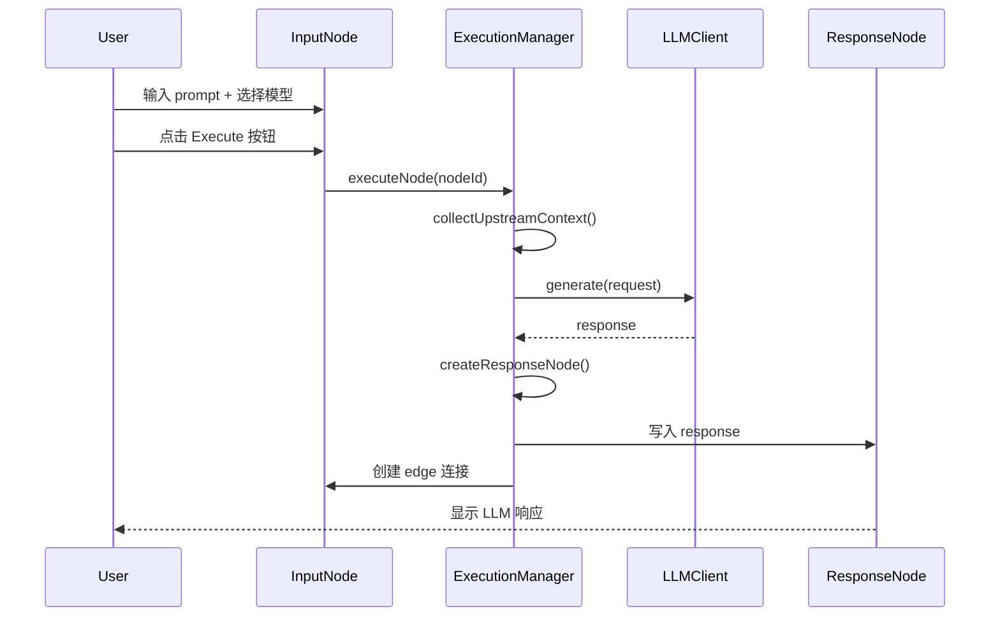
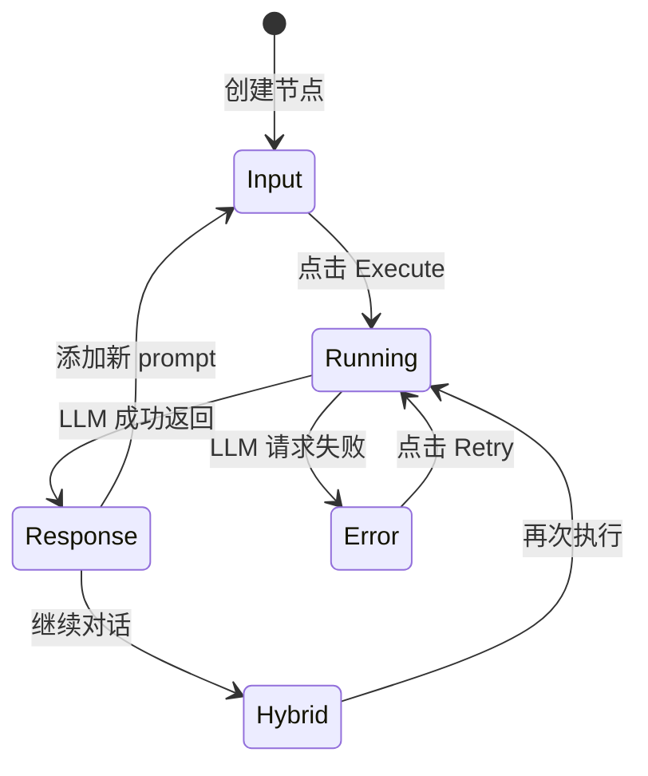

# Design Document

## Overview

本设计将 ChatNode 从单节点对话模式重构为流程化的输入-响应节点对模式。核心思想是将用户输入与 LLM 响应分离到不同节点，通过边连接形成清晰的数据流。这种设计使画布更接近传统流程图的思维模式，每个节点职责单一，便于构建复杂的多步骤 AI 工作流。

### Key Design Principles

1. **职责分离**：输入节点负责收集用户 prompt 和模型配置，响应节点负责展示 LLM 输出
2. **自动化流程**：执行时自动创建响应节点并连接，减少手动操作
3. **上下文传递**：通过边的连接自动传递对话上下文
4. **向后兼容**：支持旧格式项目的自动迁移
5. **渐进增强**：保持现有架构，最小化破坏性变更

## Architecture

### High-Level Flow



### Node Type Classification

系统将根据节点状态和连接关系动态判断节点类型：

- **Input Node（输入节点）**：
  - 特征：无下游连接 OR 有下游但 prompt 非空
  - 显示：Prompt 编辑器 + 模型选择器 + Execute 按钮
  - 行为：执行时触发 LLM 请求

- **Response Node（响应节点）**：
  - 特征：有上游连接 AND messages 包含 assistant 消息 AND prompt 为空
  - 显示：只读消息展示区（Markdown 渲染）
  - 行为：可转换为输入节点（添加新 prompt）

- **Hybrid Node（混合节点）**：
  - 特征：有上下游连接 AND 既有历史消息又有新 prompt
  - 显示：历史消息（折叠）+ Prompt 编辑器 + Execute 按钮
  - 行为：执行时更新下游节点或创建新节点

## Components and Interfaces

### 1. ChatNode Component Refactoring

```typescript
// src/canvas/nodes/ChatNode.tsx

interface ChatNodeProps extends NodeProps {
  data: ChatNodeData
}

// 新增：节点类型判断逻辑
function getNodeType(
  nodeId: string,
  nodeData: ChatNodeData,
  edges: Edge[]
): 'input' | 'response' | 'hybrid' {
  const hasDownstream = edges.some(e => e.source === nodeId)
  const hasUpstream = edges.some(e => e.target === nodeId)
  const hasPrompt = nodeData.prompt.trim().length > 0
  const hasAssistantMessages = nodeData.messages.some(m => m.role === 'assistant')
  
  if (!hasDownstream && !hasAssistantMessages) {
    return 'input'
  }
  
  if (hasUpstream && hasAssistantMessages && !hasPrompt) {
    return 'response'
  }
  
  return 'hybrid'
}

export const ChatNode = memo(({ id, data }: ChatNodeProps) => {
  const edges = useStore(state => state.edges)
  const nodeType = getNodeType(id, data, edges)
  
  return (
    <BaseNode>
      <CustomHeader 
        title={data.label} 
        icon={nodeType === 'input' ? <Edit3 /> : <MessageSquare />}
      />
      
      {/* 根据节点类型渲染不同内容 */}
      {nodeType === 'input' && <InputNodeContent {...props} />}
      {nodeType === 'response' && <ResponseNodeContent {...props} />}
      {nodeType === 'hybrid' && <HybridNodeContent {...props} />}
    </BaseNode>
  )
})
```

### 2. Input Node Content

```typescript
// src/canvas/nodes/InputNodeContent.tsx

interface InputNodeContentProps {
  nodeId: string
  data: ChatNodeData
}

export function InputNodeContent({ nodeId, data }: InputNodeContentProps) {
  const { run, stop, isRunning, canRun, requiresApiKey } = useRunNode(nodeId)
  
  return (
    <BaseNodeContent>
      <div className="space-y-4 p-4">
        {/* Model Selector */}
        <ModelSelector
          value={data.model}
          onValueChange={(model) => updateNode(nodeId, { model })}
          disabled={isRunning}
        />
        
        {/* Prompt Editor */}
        <PromptEditor
          value={data.prompt}
          onChange={(prompt) => updateNode(nodeId, { prompt })}
          placeholder="Enter your message..."
          disabled={isRunning}
          onEnter={canRun ? run : undefined}
        />
        
        {/* API Key Warning */}
        {requiresApiKey && <ApiKeyWarning />}
        
        {/* Execute Button */}
        <Button
          onClick={isRunning ? stop : run}
          disabled={!canRun && !isRunning}
          className="w-full"
        >
          {isRunning ? (
            <>
              <Square className="mr-2 size-4" />
              Stop
            </>
          ) : (
            <>
              <Play className="mr-2 size-4" />
              Execute
            </>
          )}
        </Button>
      </div>
    </BaseNodeContent>
  )
}
```

### 3. Response Node Content

```typescript
// src/canvas/nodes/ResponseNodeContent.tsx

interface ResponseNodeContentProps {
  nodeId: string
  data: ChatNodeData
}

export function ResponseNodeContent({ nodeId, data }: ResponseNodeContentProps) {
  const [isExpanded, setIsExpanded] = useState(true)
  const assistantMessages = data.messages.filter(m => m.role === 'assistant')
  
  return (
    <BaseNodeContent>
      <div className="space-y-2 p-4">
        {/* Status Indicator */}
        <NodeStatusBadge status={data.status} />
        
        {/* Message Display */}
        <div className="rounded-lg border bg-muted/30 p-3">
          {data.status === 'running' && (
            <div className="flex items-center gap-2">
              <Loader2 className="size-4 animate-spin" />
              <span className="text-sm text-muted-foreground">Generating...</span>
            </div>
          )}
          
          {data.status === 'success' && assistantMessages.length > 0 && (
            <MarkdownRenderer 
              content={assistantMessages[assistantMessages.length - 1].content}
              className="prose prose-sm max-w-none"
            />
          )}
          
          {data.status === 'error' && (
            <ErrorDisplay error={data.error} onRetry={() => retryUpstream(nodeId)} />
          )}
        </div>
        
        {/* Convert to Input Button */}
        <Button
          variant="ghost"
          size="sm"
          onClick={() => convertToInputNode(nodeId)}
          className="w-full"
        >
          <Plus className="mr-2 size-4" />
          Continue Conversation
        </Button>
      </div>
    </BaseNodeContent>
  )
}
```

### 4. Execution Manager Enhancement

```typescript
// src/hooks/useExecutionManager.ts

export function useExecutionManager(llmClient: LLMClient): ExecutionManager {
  // ... existing code ...
  
  const executeNode = useCallback(async (nodeId: string): Promise<void> => {
    const state = useStore.getState()
    const nodes = state.nodes
    const edges = state.edges
    const node = nodes.find(n => n.id === nodeId)
    if (!node) return
    
    // 1. 收集上下文
    const context = collectUpstreamContext(nodeId, nodes, edges)
    
    // 2. 检查是否已有下游响应节点
    const downstreamEdges = edges.filter(e => e.source === nodeId)
    let responseNodeId: string | null = null
    
    if (downstreamEdges.length > 0) {
      // 使用现有的响应节点（最新的一个）
      const sortedDownstream = downstreamEdges
        .map(e => nodes.find(n => n.id === e.target))
        .filter(Boolean)
        .sort((a, b) => (b?.data.createdAt ?? 0) - (a?.data.createdAt ?? 0))
      
      responseNodeId = sortedDownstream[0]?.id ?? null
    }
    
    // 3. 如果没有下游节点，创建新的响应节点
    if (!responseNodeId) {
      responseNodeId = createResponseNode(nodeId, node)
    }
    
    // 4. 设置响应节点为 running 状态
    state.setNodeStatus(responseNodeId, 'running')
    
    // 5. 执行 LLM 请求
    try {
      const response = await llmClient.generate({
        model: node.data.model,
        messages: [
          ...context.messages,
          { role: 'user', content: node.data.prompt }
        ]
      }, { signal: abortController.signal })
      
      // 6. 写入响应到响应节点
      const assistantMessage: ChatMessage = {
        id: `msg-${Date.now()}`,
        role: 'assistant',
        content: response.content,
        createdAt: Date.now()
      }
      
      state.addMessageToNode(responseNodeId, assistantMessage)
      state.setNodeStatus(responseNodeId, 'success')
      
      // 7. 清空输入节点的 prompt
      state.updateNode(nodeId, { prompt: '' })
      state.setNodeStatus(nodeId, 'idle')
      
    } catch (error) {
      // 错误处理：在响应节点显示错误
      state.setNodeStatus(responseNodeId, 'error')
      state.updateNode(responseNodeId, { 
        error: formatError(error) 
      })
    }
  }, [llmClient])
  
  return { executeNode, /* ... */ }
}

// 新增：创建响应节点的辅助函数
function createResponseNode(
  sourceNodeId: string,
  sourceNode: Node<ChatNodeData>
): string {
  const state = useStore.getState()
  
  const responseNodeId = `node-${Date.now()}`
  const responseNode: Node<ChatNodeData> = {
    id: responseNodeId,
    type: 'chat',
    position: {
      x: sourceNode.position.x + 300,
      y: sourceNode.position.y
    },
    data: {
      label: `Response from ${sourceNode.data.label}`,
      model: sourceNode.data.model,
      prompt: '',
      messages: [],
      status: 'idle',
      createdAt: Date.now()
    }
  }
  
  // 添加节点
  state.addNode(responseNode)
  
  // 创建边
  const edge: Edge = {
    id: `edge-${Date.now()}`,
    source: sourceNodeId,
    target: responseNodeId,
    type: 'default'
  }
  state.addEdge(edge)
  
  return responseNodeId
}
```

## Data Models

### Enhanced ChatNodeData

```typescript
// src/types.ts

export interface ChatNodeData {
  // 基础字段
  label: string
  description?: string
  model: string
  prompt: string
  messages: ChatMessage[]
  status: NodeStatus
  error?: string
  
  // 新增字段
  createdAt: number          // 节点创建时间，用于排序
  nodeType?: 'input' | 'response' | 'hybrid'  // 可选：显式标记类型
  sourceNodeId?: string      // 响应节点：记录来源输入节点 ID
  
  // 执行配置
  temperature?: number
  maxTokens?: number
}

export interface ChatMessage {
  id: string
  role: 'user' | 'assistant' | 'system'
  content: string
  createdAt: number          // 修改：使用 createdAt 替代 timestamp
  metadata?: {
    model?: string           // 记录生成此消息的模型
    tokens?: number          // token 使用量
  }
}
```

### Node State Transitions



## Error Handling

### Error Display Strategy

1. **输入节点错误**：
   - 显示在节点内部的警告区域
   - 提供 Retry 按钮
   - 不创建响应节点

2. **响应节点错误**：
   - 在响应节点内显示错误信息
   - 提供 Retry 按钮（重新执行上游输入节点）
   - 保留错误状态直到成功重试

3. **上下文错误**：
   - 如果上游节点包含错误，执行前弹出确认对话框
   - 警告用户上下文可能不完整

### Error Types

```typescript
// src/types/errors.ts

export type NodeErrorType = 
  | 'api_key_missing'
  | 'api_key_invalid'
  | 'rate_limit'
  | 'network_error'
  | 'model_not_found'
  | 'context_incomplete'
  | 'unknown'

export interface NodeError {
  type: NodeErrorType
  message: string
  retryable: boolean
  actionLabel?: string
  actionHandler?: () => void
}
```

## Testing Strategy

### Unit Tests

1. **Node Type Detection**
   ```typescript
   describe('getNodeType', () => {
     it('should return input for new node without connections', () => {
       const nodeType = getNodeType(nodeId, nodeData, [])
       expect(nodeType).toBe('input')
     })
     
     it('should return response for node with upstream and assistant messages', () => {
       const edges = [{ source: 'node-1', target: nodeId }]
       const nodeData = { 
         prompt: '', 
         messages: [{ role: 'assistant', content: 'Hello' }] 
       }
       expect(getNodeType(nodeId, nodeData, edges)).toBe('response')
     })
   })
   ```

2. **Response Node Creation**
   ```typescript
   describe('createResponseNode', () => {
     it('should create node at correct position', () => {
       const sourceNode = { position: { x: 100, y: 200 } }
       const responseNodeId = createResponseNode('source-id', sourceNode)
       const responseNode = store.getState().nodes.find(n => n.id === responseNodeId)
       expect(responseNode.position).toEqual({ x: 400, y: 200 })
     })
     
     it('should create edge connecting source to response', () => {
       const responseNodeId = createResponseNode('source-id', sourceNode)
       const edge = store.getState().edges.find(e => 
         e.source === 'source-id' && e.target === responseNodeId
       )
       expect(edge).toBeDefined()
     })
   })
   ```

3. **Context Collection**
   ```typescript
   describe('collectUpstreamContext', () => {
     it('should include messages from all upstream nodes', () => {
       const context = collectUpstreamContext(targetNodeId, nodes, edges)
       expect(context.messages).toHaveLength(4) // 2 nodes × 2 messages
     })
     
     it('should maintain topological order', () => {
       const context = collectUpstreamContext(targetNodeId, nodes, edges)
       expect(context.executionOrder).toEqual(['node-1', 'node-2', 'node-3'])
     })
   })
   ```

### Integration Tests

1. **Complete Execution Flow**
   - 创建输入节点 → 输入 prompt → 执行 → 验证响应节点创建 → 验证边连接

2. **Multi-Step Conversation**
   - 创建节点链 A → B → C → 执行 C → 验证上下文包含 A 和 B 的消息

3. **Error Recovery**
   - 模拟 API 错误 → 验证错误显示 → 点击 Retry → 验证成功恢复

### E2E Tests

```typescript
// tests/e2e/chatnode-flow.spec.ts

test('should create response node on execution', async ({ page }) => {
  // 1. 创建输入节点
  await page.click('[data-testid="new-node-button"]')
  
  // 2. 输入 prompt
  await page.fill('[data-testid="prompt-editor"]', 'Hello, world!')
  
  // 3. 选择模型
  await page.selectOption('[data-testid="model-selector"]', 'gpt-4')
  
  // 4. 执行
  await page.click('[data-testid="execute-button"]')
  
  // 5. 等待响应节点出现
  await page.waitForSelector('[data-testid="response-node"]')
  
  // 6. 验证边连接
  const edges = await page.locator('[data-testid="edge"]').count()
  expect(edges).toBe(1)
  
  // 7. 验证响应内容
  const responseContent = await page.textContent('[data-testid="response-content"]')
  expect(responseContent).toContain('Mock response')
})
```

## Migration Strategy

### Backward Compatibility

```typescript
// src/services/migration.ts

export interface MigrationResult {
  success: boolean
  migratedNodes: number
  errors: string[]
  report: string
}

export function migrateProjectToV2(
  snapshot: ProjectSnapshot
): MigrationResult {
  const result: MigrationResult = {
    success: true,
    migratedNodes: 0,
    errors: [],
    report: ''
  }
  
  const newNodes: Node[] = []
  const newEdges: Edge[] = []
  
  snapshot.graph.nodes.forEach(node => {
    if (node.type !== 'chat') {
      newNodes.push(node)
      return
    }
    
    const nodeData = node.data as ChatNodeData
    
    // 如果节点包含多条消息，需要拆分
    if (nodeData.messages.length > 1) {
      const userMessages = nodeData.messages.filter(m => m.role === 'user')
      const assistantMessages = nodeData.messages.filter(m => m.role === 'assistant')
      
      // 创建输入节点（保留最后一条用户消息）
      const inputNode: Node = {
        ...node,
        data: {
          ...nodeData,
          prompt: userMessages[userMessages.length - 1]?.content ?? '',
          messages: []
        }
      }
      newNodes.push(inputNode)
      
      // 创建响应节点（包含所有助手消息）
      const responseNode: Node = {
        id: `${node.id}-response`,
        type: 'chat',
        position: {
          x: node.position.x + 300,
          y: node.position.y
        },
        data: {
          label: `Response from ${nodeData.label}`,
          model: nodeData.model,
          prompt: '',
          messages: assistantMessages,
          status: 'success',
          createdAt: Date.now()
        }
      }
      newNodes.push(responseNode)
      
      // 创建连接边
      newEdges.push({
        id: `${node.id}-to-response`,
        source: node.id,
        target: responseNode.id,
        type: 'default'
      })
      
      result.migratedNodes++
    } else {
      // 单条消息或空节点，直接保留
      newNodes.push(node)
    }
  })
  
  // 保留原有的边
  newEdges.push(...snapshot.graph.edges)
  
  // 更新 snapshot
  snapshot.graph.nodes = newNodes
  snapshot.graph.edges = newEdges
  snapshot.version = 2
  
  result.report = `Migrated ${result.migratedNodes} nodes to new format`
  
  return result
}
```

### Migration UI

```typescript
// src/components/MigrationDialog.tsx

export function MigrationDialog({ 
  result, 
  onConfirm, 
  onCancel 
}: MigrationDialogProps) {
  return (
    <Dialog open>
      <DialogContent>
        <DialogHeader>
          <DialogTitle>Project Migration Required</DialogTitle>
          <DialogDescription>
            This project was created with an older version and needs to be migrated.
          </DialogDescription>
        </DialogHeader>
        
        <div className="space-y-2">
          <p className="text-sm">
            <strong>Changes:</strong>
          </p>
          <ul className="list-disc pl-5 text-sm">
            <li>{result.migratedNodes} nodes will be split into input-response pairs</li>
            <li>Conversation history will be preserved</li>
            <li>All connections will be maintained</li>
          </ul>
          
          {result.errors.length > 0 && (
            <Alert variant="destructive">
              <AlertCircle className="size-4" />
              <AlertTitle>Migration Warnings</AlertTitle>
              <AlertDescription>
                {result.errors.map((error, i) => (
                  <div key={i}>{error}</div>
                ))}
              </AlertDescription>
            </Alert>
          )}
        </div>
        
        <DialogFooter>
          <Button variant="outline" onClick={onCancel}>
            Cancel
          </Button>
          <Button onClick={onConfirm}>
            Migrate Project
          </Button>
        </DialogFooter>
      </DialogContent>
    </Dialog>
  )
}
```

## Performance Considerations

### Optimization Strategies

1. **Lazy Node Type Calculation**
   - 使用 `useMemo` 缓存节点类型判断结果
   - 仅在 edges 或 nodeData 变化时重新计算

2. **Virtualized Message Rendering**
   - 响应节点中的长消息使用虚拟滚动
   - 仅渲染可见区域的内容

3. **Debounced Prompt Updates**
   - Prompt 输入使用防抖，减少状态更新频率
   - 默认 300ms 延迟

4. **Selective Re-rendering**
   - 使用 `React.memo` 包裹子组件
   - 使用 Zustand 的 selector 精确订阅需要的状态

```typescript
// 示例：优化的节点类型计算
const nodeType = useMemo(
  () => getNodeType(id, data, edges),
  [id, data.prompt, data.messages.length, edges]
)
```

## Accessibility Enhancements

### Keyboard Navigation

- **Tab**: 在节点内的控件间导航
- **Enter**: 在 Prompt Editor 中按 Enter 执行（需要 Shift+Enter 换行）
- **Escape**: 取消正在运行的节点

### Screen Reader Support

```typescript
// 响应节点的 ARIA 标签
<div
  role="article"
  aria-label={`Response from ${sourceNode.label}`}
  aria-live="polite"
  aria-busy={status === 'running'}
>
  {/* 内容 */}
</div>

// 执行按钮的状态公告
<Button
  aria-label={isRunning ? 'Stop execution' : 'Execute node'}
  aria-describedby="execution-status"
>
  {/* 按钮内容 */}
</Button>
<div id="execution-status" className="sr-only" aria-live="assertive">
  {isRunning ? 'Node is running' : 'Node is idle'}
</div>
```

## Visual Design

### Node Visual States

```css
/* Input Node */
.node-input {
  border: 2px solid hsl(var(--primary));
  background: hsl(var(--background));
}

.node-input:hover {
  box-shadow: 0 0 0 4px hsl(var(--primary) / 0.1);
}

/* Response Node */
.node-response {
  border: 2px solid hsl(var(--muted-foreground));
  background: hsl(var(--muted) / 0.3);
}

/* Running State */
.node-running {
  border-color: hsl(var(--blue-500));
  animation: pulse-border 2s ease-in-out infinite;
}

@keyframes pulse-border {
  0%, 100% { border-color: hsl(var(--blue-500)); }
  50% { border-color: hsl(var(--blue-300)); }
}

/* Success State */
.node-success {
  border-color: hsl(var(--green-500));
}

/* Error State */
.node-error {
  border-color: hsl(var(--red-500));
  background: hsl(var(--red-50));
}
```

### Icon System

- **Input Node**: `<Edit3 />` - 表示编辑/输入
- **Response Node**: `<MessageSquare />` - 表示消息/响应
- **Execute Button**: `<Play />` - 表示执行
- **Stop Button**: `<Square />` - 表示停止
- **Loading**: `<Loader2 className="animate-spin" />` - 表示加载中

## Implementation Phases

### Phase 1: Core Refactoring (Week 1)
- [ ] 重构 ChatNode 组件，支持节点类型判断
- [ ] 实现 InputNodeContent 和 ResponseNodeContent
- [ ] 更新 ExecutionManager 支持自动创建响应节点
- [ ] 单元测试覆盖核心逻辑

### Phase 2: UI Polish (Week 2)
- [ ] 实现节点状态视觉反馈（颜色、动画）
- [ ] 添加 Markdown 渲染到响应节点
- [ ] 实现"Continue Conversation"功能
- [ ] 添加错误处理和重试机制

### Phase 3: Migration & Compatibility (Week 3)
- [ ] 实现项目迁移逻辑
- [ ] 创建迁移对话框 UI
- [ ] 测试旧项目的自动迁移
- [ ] 文档更新

### Phase 4: Testing & Optimization (Week 4)
- [ ] E2E 测试覆盖完整流程
- [ ] 性能优化（虚拟化、缓存）
- [ ] 可访问性审计
- [ ] Bug 修复和打磨

## Open Questions

1. **多下游节点处理**：如果输入节点有多个下游节点，应该更新哪一个？
   - 建议：更新最近创建的节点，或提供选择器让用户选择

2. **历史消息展示**：响应节点是否需要显示完整的对话历史？
   - 建议：默认只显示最新的响应，提供"Show History"按钮展开

3. **节点标题自动生成**：响应节点的标题是否应该基于内容自动生成？
   - 建议：Phase 1 使用固定格式，Phase 2 可以添加 AI 生成标题功能

4. **撤销/重做支持**：节点自动创建是否应该作为单个操作记录到历史？
   - 建议：是，创建响应节点和边应该作为一个原子操作
