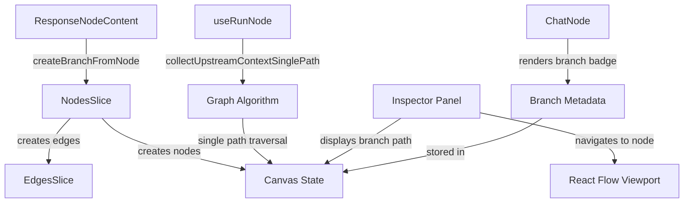

# Design Document

## Overview

The Conversation Branching feature extends the existing Canvas System to support multiple independent conversation paths from any Response node. The design leverages the existing Zustand state architecture, React Flow canvas, and context collection algorithms while introducing new metadata fields, a single-path context collection algorithm, and enhanced UI components for branch management.

The core design principle is **branch isolation**: each branch maintains its own independent message history by modifying the context collection algorithm to follow only a single path from the current node to the root, preventing cross-branch contamination.

## Architecture

### High-Level Component Interaction



### Data Flow for Branch Creation

1. User clicks "Continue Conversation" button on Response node
2. `ResponseNodeContent` calls `createBranchFromNode(nodeId)`
3. `NodesSlice.createBranchFromNode`:
   - Calculates branch index and position offsets
   - Creates new Input node with branch metadata
   - Creates new Response node (placeholder)
   - Adds edges with branch metadata
4. Canvas re-renders with new nodes and edges
5. User enters prompt in Input node
6. Execution triggers with single-path context collection

### Data Flow for Context Collection

1. Node execution begins via `useRunNode`
2. `collectUpstreamContextSinglePath` is called
3. Algorithm traverses single path from current node to root
4. Messages collected in chronological order
5. LLM request sent with branch-isolated context
6. Response written to Response node

## Components and Interfaces

### 1. Enhanced Type Definitions

```typescript
// src/types.ts - Add to ChatNodeData interface
export interface ChatNodeData extends BaseNodeData, Record<string, unknown> {
  // ... existing fields
  
  // Branch metadata
  branchId?: string;        // Unique identifier for this branch
  parentNodeId?: string;    // Direct parent node ID
  branchIndex?: number;     // Index among siblings (0, 1, 2...)
}

// src/types.ts - Add to CustomEdgeData interface
export interface CustomEdgeData {
  createdAt: number;
  branchIndex?: number;     // Index for branch edges
  isBranchEdge?: boolean;   // Flag to identify branch edges
}

// src/types.ts - New interface for branch metadata
export interface BranchMetadata {
  branchId: string;
  parentNodeId: string;
  depth: number;            // Distance from root
  messageCount: number;     // Total messages in branch
  createdAt: number;
}
```

### 2. NodesSlice Enhancement

```typescript
// src/state/createNodesSlice.ts - Add new method
export interface NodesSlice {
  // ... existing methods
  
  // Branch operations
  createBranchFromNode: (nodeId: string) => void;
  getBranchMetadata: (nodeId: string) => BranchMetadata | null;
  getBranchPath: (nodeId: string) => Node[];
  getSiblingBranches: (nodeId: string) => Node[];
}
```

**Implementation Details:**

```typescript
createBranchFromNode: (nodeId: string) => {
  const state = get()
  const sourceNode = state.nodes.find(n => n.id === nodeId)
  if (!sourceNode) return

  // Calculate branch index
  const existingBranches = state.edges.filter(e => e.source === nodeId)
  const branchIndex = existingBranches.length

  // Generate unique branch ID
  const branchId = `${nodeId}-branch-${branchIndex}-${Date.now()}`

  // Calculate position offsets
  const offsetX = branchIndex * 350  // Horizontal spacing
  const offsetY = 200                 // Vertical spacing

  // Create Input node
  const inputNodeId = `node-${Date.now()}`
  const inputNode: Node = {
    id: inputNodeId,
    type: 'chat',
    position: {
      x: sourceNode.position.x + offsetX,
      y: sourceNode.position.y + offsetY,
    },
    data: {
      label: `Continue from ${sourceNode.data.label}`,
      model: sourceNode.data.model,
      prompt: '',
      messages: [],
      status: 'idle',
      createdAt: Date.now(),
      nodeType: 'input',
      branchId,
      parentNodeId: nodeId,
      branchIndex,
    },
  }

  // Create Response node (placeholder)
  const responseNodeId = `node-${Date.now() + 1}`
  const responseNode: Node = {
    id: responseNodeId,
    type: 'chat',
    position: {
      x: inputNode.position.x,
      y: inputNode.position.y + offsetY,
    },
    data: {
      label: `Response ${branchIndex + 1}`,
      model: sourceNode.data.model,
      prompt: '',
      messages: [],
      status: 'idle',
      createdAt: Date.now() + 1,
      nodeType: 'response',
      sourceNodeId: inputNodeId,
      branchId,
      parentNodeId: inputNodeId,
      branchIndex,
    },
  }

  // Add nodes
  state.addNode(inputNode)
  state.addNode(responseNode)

  // Add edges with branch metadata
  state.addEdge({
    id: `edge-${Date.now()}`,
    source: nodeId,
    target: inputNodeId,
    data: {
      branchIndex,
      isBranchEdge: true,
      createdAt: Date.now(),
    },
  })

  state.addEdge({
    id: `edge-${Date.now() + 1}`,
    source: inputNodeId,
    target: responseNodeId,
    data: {
      branchIndex,
      isBranchEdge: true,
      createdAt: Date.now() + 1,
    },
  })
}
```

### 3. Single-Path Context Collection Algorithm

```typescript
// src/algorithms/collectUpstreamContext.ts - New function
export function collectUpstreamContextSinglePath(
  targetNodeId: string,
  nodes: Node<ChatNodeData>[],
  edges: Edge[]
): ExecutionContext {
  const messages: Array<{ role: 'user' | 'assistant' | 'system'; content: string }> = []
  const executionOrder: string[] = []
  const upstreamNodes: Node<ChatNodeData>[] = []
  let hasErrors = false
  const errorNodes: string[] = []
  
  let currentId: string | null = targetNodeId
  
  // Traverse single path from target to root
  while (currentId) {
    const node = nodes.find(n => n.id === currentId)
    
    if (node) {
      // Add to execution order (will reverse later)
      executionOrder.unshift(currentId)
      upstreamNodes.unshift(node)
      
      // Check for errors
      if (node.data.status === 'error') {
        hasErrors = true
        errorNodes.push(currentId)
      }
      
      // Collect messages from this node
      if (node.data.messages && node.data.messages.length > 0) {
        // Add messages in order (will be in correct order after path reversal)
        node.data.messages.forEach(msg => {
          messages.unshift({
            role: msg.role,
            content: msg.content,
          })
        })
      }
    }
    
    // Find direct parent (single path)
    const parentEdge = edges.find(e => e.target === currentId)
    currentId = parentEdge?.source ?? null
  }
  
  // Reverse messages to get chronological order
  messages.reverse()
  
  return {
    nodeId: targetNodeId,
    upstreamNodes,
    messages,
    executionOrder,
    hasErrors,
    errorNodes,
    isComplete: !hasErrors,
  }
}
```

### 4. ResponseNodeContent Enhancement

```typescript
// src/canvas/nodes/ResponseNodeContent.tsx - Update button handler
const handleContinueConversation = useCallback(() => {
  const { createBranchFromNode } = useStore.getState()
  createBranchFromNode(nodeId)
}, [nodeId])
```

### 5. Branch Visualization Components

```typescript
// src/canvas/components/BranchBadge.tsx - New component
interface BranchBadgeProps {
  branchIndex: number;
  branchId: string;
}

export function BranchBadge({ branchIndex, branchId }: BranchBadgeProps) {
  return (
    <div
      className="absolute -top-2 -right-2 rounded-full bg-primary px-2 py-0.5 text-xs font-medium text-primary-foreground"
      title={`Branch ${branchIndex + 1}`}
    >
      B{branchIndex + 1}
    </div>
  )
}
```

```typescript
// src/canvas/edges/BranchEdge.tsx - Enhanced edge styling
export function BranchEdge({ id, sourceX, sourceY, targetX, targetY, data }: EdgeProps) {
  const isBranchEdge = data?.isBranchEdge
  const branchIndex = data?.branchIndex ?? 0
  
  // Color palette for branches
  const branchColors = [
    'stroke-blue-500',
    'stroke-green-500',
    'stroke-purple-500',
    'stroke-orange-500',
    'stroke-pink-500',
  ]
  
  const strokeColor = isBranchEdge
    ? branchColors[branchIndex % branchColors.length]
    : 'stroke-gray-400'
  
  return (
    <BaseEdge
      id={id}
      path={getSmoothStepPath({ sourceX, sourceY, targetX, targetY })}
      className={cn('stroke-2', strokeColor)}
      markerEnd="url(#arrow)"
    />
  )
}
```

### 6. Inspector Panel Enhancement

```typescript
// src/canvas/components/Inspector.tsx - Add branch section
interface InspectorProps {
  selectedNodeId: string | null;
}

export function Inspector({ selectedNodeId }: InspectorProps) {
  const node = useStore(state => 
    state.nodes.find(n => n.id === selectedNodeId)
  )
  const getBranchPath = useStore(state => state.getBranchPath)
  const getSiblingBranches = useStore(state => state.getSiblingBranches)
  
  if (!node) return null
  
  const branchPath = getBranchPath(node.id)
  const siblings = getSiblingBranches(node.id)
  
  return (
    <div className="space-y-4 p-4">
      {/* Existing inspector content */}
      
      {/* Branch Path Section */}
      {node.data.branchId && (
        <div className="space-y-2">
          <h3 className="text-sm font-medium">Branch Path</h3>
          <div className="flex flex-wrap gap-1">
            {branchPath.map((pathNode, index) => (
              <Fragment key={pathNode.id}>
                <Button
                  variant="outline"
                  size="sm"
                  onClick={() => focusNode(pathNode.id)}
                >
                  {pathNode.data.label}
                </Button>
                {index < branchPath.length - 1 && (
                  <ChevronRight className="size-4 text-muted-foreground" />
                )}
              </Fragment>
            ))}
          </div>
        </div>
      )}
      
      {/* Sibling Branches Section */}
      {siblings.length > 0 && (
        <div className="space-y-2">
          <h3 className="text-sm font-medium">Sibling Branches</h3>
          <div className="space-y-1">
            {siblings.map(sibling => (
              <Button
                key={sibling.id}
                variant="ghost"
                size="sm"
                className="w-full justify-start"
                onClick={() => focusNode(sibling.id)}
              >
                <GitBranch className="mr-2 size-4" />
                {sibling.data.label}
              </Button>
            ))}
          </div>
        </div>
      )}
    </div>
  )
}
```

## Data Models

### Node Data Structure with Branch Metadata

```typescript
{
  id: "node-1234567890",
  type: "chat",
  position: { x: 100, y: 200 },
  data: {
    label: "Continue from Initial Question",
    model: "gpt-4o",
    prompt: "Tell me more about X",
    messages: [...],
    status: "success",
    createdAt: 1234567890,
    nodeType: "input",
    
    // Branch metadata
    branchId: "node-1234567890-branch-0-1234567891",
    parentNodeId: "node-1234567890",
    branchIndex: 0
  }
}
```

### Edge Data Structure with Branch Metadata

```typescript
{
  id: "edge-1234567890",
  source: "node-parent",
  target: "node-child",
  data: {
    createdAt: 1234567890,
    branchIndex: 0,
    isBranchEdge: true
  }
}
```

## Error Handling

### Branch Creation Errors

1. **Source Node Not Found**: Log warning and return early
2. **Invalid Node Type**: Only allow branching from Response nodes with success status
3. **Position Calculation Overflow**: Implement viewport bounds checking

### Context Collection Errors

1. **Circular Reference**: Should not occur with single-path algorithm, but add safeguard
2. **Missing Parent Edge**: Handle gracefully by treating as root node
3. **Incomplete Context**: Flag in ExecutionContext.isComplete

### UI Error States

1. **Branch Creation Failed**: Show toast notification
2. **Navigation Failed**: Fallback to current viewport
3. **Metadata Missing**: Use default values and log warning

## Testing Strategy

### Unit Tests

1. **collectUpstreamContextSinglePath**
   - Test single linear path
   - Test branching scenarios (verify only one path followed)
   - Test message ordering
   - Test error node detection
   - Test empty path handling

2. **NodesSlice.createBranchFromNode**
   - Test node creation with correct metadata
   - Test position calculation
   - Test branch index increment
   - Test edge creation with metadata

3. **NodesSlice.getBranchPath**
   - Test path reconstruction
   - Test root node handling
   - Test circular reference protection

4. **NodesSlice.getSiblingBranches**
   - Test sibling detection
   - Test empty result handling

### Integration Tests

1. **Branch Creation Flow**
   - Create branch from Response node
   - Verify nodes and edges created
   - Verify metadata populated correctly

2. **Context Isolation**
   - Create multiple branches
   - Execute each branch
   - Verify contexts are independent

3. **Branch Navigation**
   - Select branch node
   - Verify Inspector shows correct path
   - Navigate to path node
   - Verify viewport focuses correctly

### Visual Regression Tests

1. Branch badge rendering
2. Branch edge coloring
3. Multi-branch layout
4. Inspector panel branch sections

## Performance Considerations

### Optimization Strategies

1. **Memoization**: Memoize `getBranchPath` and `getSiblingBranches` results
2. **Lazy Loading**: Only calculate branch metadata when Inspector is open
3. **Virtual Scrolling**: Already implemented for long message lists
4. **Edge Rendering**: Use React Flow's built-in edge optimization

### Scalability Limits

- **Max Branches per Node**: Soft limit of 10 (UI becomes crowded)
- **Max Branch Depth**: No hard limit, but recommend < 20 for performance
- **Message History**: Already handled by virtual scrolling

## Accessibility

### Keyboard Navigation

- Tab through branch path breadcrumbs
- Enter to focus on branch node
- Arrow keys to navigate between siblings

### Screen Reader Support

- Announce branch creation: "Created new branch from [node name]"
- Announce branch navigation: "Focused on [node name] in branch [index]"
- Branch badge has aria-label: "Branch [index]"

### Visual Indicators

- High contrast branch colors
- Clear branch badge positioning
- Distinct edge styling for branches

## Migration and Backward Compatibility

### Existing Projects

- Projects without branch metadata will continue to work
- `branchId`, `parentNodeId`, `branchIndex` are optional fields
- Old context collection algorithm remains as fallback

### Data Migration

No migration needed - new fields are additive and optional.

### Feature Flag

Consider adding feature flag for gradual rollout:

```typescript
// src/config/features.ts
export const FEATURES = {
  conversationBranching: true, // Enable/disable branching
}
```

## Future Enhancements

1. **Branch Merging**: Combine multiple branches into single node
2. **Branch Comparison**: Side-by-side view of branch responses
3. **Branch Templates**: Save branch structures as reusable templates
4. **Branch Analytics**: Track which branches lead to best results
5. **Automatic Layout**: Smart positioning algorithm for complex trees
6. **Branch Folding**: Collapse/expand branches to reduce clutter
