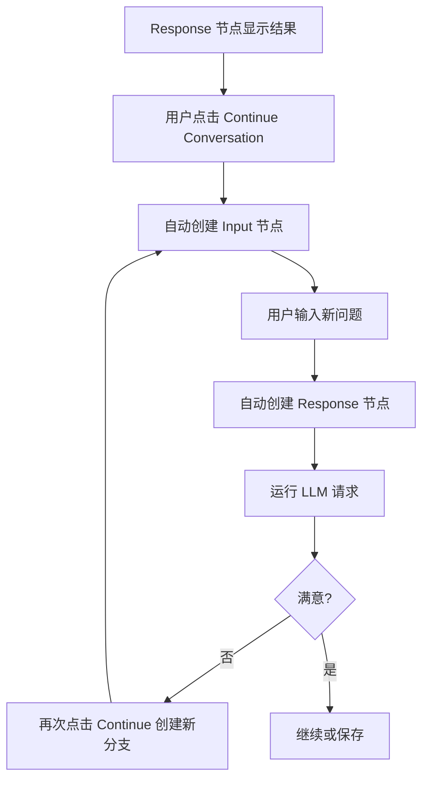

## UI 组件 / 路由 / 状态结构草图（React + Zustand + React Flow）

本草图基于 `prd.md` 与 `issues.md` 的里程碑与优先级，面向 MVP（里程碑 A 为主，B/C 预留）。

### 一、信息架构与主用户流（High-level）

```mermaid
flowchart LR
  A[项目入口 / ProjectHub] --> B[新建或打开项目]
  B --> C[/Canvas 画布/]
  C --> D[创建聊天节点]
  D --> E[连线与上下文传递]
  E --> F[运行节点 / LLM 请求]
  F --> G{结果满意?}
  G -- 是 --> H[保存/导出]
  G -- 否 --> D2[编辑提示/分叉新节点]
  D2 --> F
  C --> S[Settings 设置(API Key/模型)]
```

---

### 二、路由结构（React Router）

```tsx
// src/app/router.tsx
import { createBrowserRouter } from 'react-router-dom'

export const router = createBrowserRouter([
  { path: '/', element: <ProjectHubPage /> },
  {
    path: '/project/:projectId',
    element: <CanvasPage />,
    children: [
      // Modal 路由（覆盖层展示）
      { path: 'settings', element: <SettingsModal /> },
      // P1：模板与导出
      { path: 'templates', element: <TemplatesDrawer /> },
    ],
  },
])
```

- `/`：项目中心（最近项目、创建/导入）
- `/project/:projectId`：主画布
- `/project/:projectId/settings`：设置（API Key、默认模型等，Modal 路由）
- `/project/:projectId/templates`：模板抽屉（P1）

---

### 三、核心页面与组件树

```text
<AppShell>
  <TopBar>
    <ProjectTitle /> <SaveIndicator /> <GlobalActions>
      <ExportButton /> <SettingsButton />
    </GlobalActions>
  </TopBar>

  <CanvasLayout>
    <LeftToolbar>
      <NewNodeButton /> <ConnectHint /> <UndoRedo />
    </LeftToolbar>

    <ReactFlowCanvas>
      {GridBackground}
      {MiniMap (P1)}
      {Controls (P1)}
      {ChatNode as nodeTypes.chat}
      {SmartEdge as edgeTypes.default}
    </ReactFlowCanvas>

    <RightPanel>
      <Inspector />          // 选中节点/边属性
      <RunQueuePanel />      // P2 并发/队列
    </RightPanel>
  </CanvasLayout>

  <Toaster />                // 全局状态吐司
  <CommandPalette />          // P1

  <SettingsModal />           // 路由子节点渲染
</AppShell>
```

- 关键组件
  - `AppShell`：页面布局与主题容器
  - `TopBar`：项目名、保存状态、导出/设置入口
  - `ReactFlowCanvas`：包裹 React Flow，注册 `nodeTypes`/`edgeTypes`
  - `ChatNode`：自定义节点（标题、模型徽章、运行/停止、复制、删除、内容区）
  - `LeftToolbar`/`RightPanel`：工具与属性/状态面板
  - `SettingsModal`：API Key、默认模型、语言、代理等

---

### 四、React Flow 类型与集成

```ts
// src/canvas/types.ts
export type NodeStatus = 'idle' | 'running' | 'error' | 'success'

export interface ChatMessage {
  id: string
  role: 'user' | 'assistant' | 'system'
  content: string // markdown
  createdAt: number
}

export interface ChatNodeData {
  title: string
  modelId: string
  prompt: string // 当前提示词
  messages: ChatMessage[] // 历史消息（P1 可虚拟化显示）
  status: NodeStatus
  error?: { code: string; message: string }
}
```

```ts
// src/canvas/register.ts
import { ChatNode } from './nodes/ChatNode'
import { SmartEdge } from './edges/SmartEdge'

export const nodeTypes = { chat: ChatNode } as const
export const edgeTypes = { default: SmartEdge } as const
```

```tsx
// src/pages/CanvasPage.tsx（核心事件桥接）
<ReactFlow
  nodes={nodes}
  edges={edges}
  nodeTypes={nodeTypes}
  edgeTypes={edgeTypes}
  onNodesChange={handleNodesChange}
  onEdgesChange={handleEdgesChange}
  onConnect={handleConnect}
  fitView
/>
```

- 事件处理对接 `Zustand`：
  - `handleNodesChange` → `nodesSlice.applyChanges`
  - `handleEdgesChange` → `edgesSlice.applyChanges`
  - `handleConnect` → `edgesSlice.addEdge`（含循环校验）
  - `handleNodeRun` → `useRunNode(nodeId)`（收集上下游上下文并调度执行）

运行流程要点：

1. 节点触发运行时，通过 `collectUpstreamContext` 获取所有上游节点最后 N 条消息，组装为请求上下文。
2. `useExecutionManager` 将节点加入运行队列，`RuntimeSlice.runNext` 负责调度并支持多节点并发。
3. LLM 请求挂载 `AbortController`，便于 Stop 按钮取消；成功与失败都会写回 `messages/status/error`。
4. 完成后 `RuntimeSlice` 清理 `inFlight`，触发下一任务，保持 UI 状态一致。

---

### 五、Zustand 状态切片（Slices）

目录建议：

```text
src/state/
  createProjectSlice.ts
  createCanvasSlice.ts
  createNodesSlice.ts
  createEdgesSlice.ts
  createRuntimeSlice.ts
  createSettingsSlice.ts
  createUiSlice.ts
  createTemplatesSlice.ts
  store.ts
```

统一 Store：

```ts
// src/state/store.ts
import { create } from 'zustand'
import { devtools } from 'zustand/middleware'
import { persist } from 'zustand/middleware'
// 可选：自集成 immer（以 set(state => { ... }) 形式实现）

export interface RootState
  extends ProjectSlice,
    CanvasSlice,
    NodesSlice,
    EdgesSlice,
    RuntimeSlice,
    SettingsSlice,
    UiSlice,
    TemplatesSlice {}

export const useStore = create<RootState>()(
  devtools(
    persist(
      (set, get) => ({
        ...createProjectSlice(set, get),
        ...createCanvasSlice(set, get),
        ...createNodesSlice(set, get),
        ...createEdgesSlice(set, get),
        ...createRuntimeSlice(set, get),
        ...createSettingsSlice(set, get),
        ...createUiSlice(set, get),
        ...createTemplatesSlice(set, get),
      }),
      {
        name: 'canvas-app',
        partialize: s => ({ project: s.project, settings: s.settings }),
      }
    )
  )
)
```

各切片要点：

- `ProjectSlice`
  - `currentProjectId: string | null`
  - `snapshot: ProjectSnapshot | null`（仅持久化 metadata、settings、history、节点/边引用）
  - `deriveSnapshot()`：从 `nodes`、`edges`、`settings`、`canvas` 切片组合保存 payload
  - `hydrateProject(snapshot)`：重置 `nodes/edges/canvas/settings` 到导入状态
  - `newProject() / openProject(file) / saveProject()`（`save` 将写入 `snapshot` 并触发持久化）

- `CanvasSlice`
  - `viewport { x, y, zoom }`、`snapToGrid: boolean`、`selection: ids[]`
  - `history { past[], present, future[] }`、`undo()/redo()`

- `NodesSlice`
  - `nodes: Node<ChatNodeData>[]`
  - `createNode(type: 'chat', position)`、`updateNode(id, draft)`、`duplicateNode(id)`
  - `setNodePosition(id, position)`、`removeNode(id)`
  - `applyNodes(nodes)`：导入项目时批量写入节点数组

- `EdgesSlice`
  - `edges: Edge[]`
  - `addEdge(conn)`、`removeEdge(id)`、`validateNoCycle(source, target)`
  - `applyEdges(edges)`：导入项目时批量写入边数组

- `RuntimeSlice`
  - `queue: RunTask[]`、`inFlight: Record<string, RunTask>`
  - `maxConcurrent`（P0 默认 `Infinity`，P2 可配置）
  - `enqueue(nodeId)`、`dequeue()`、`cancel(taskId)`
  - `setNodeStatus(id, status)`、`setNodeError(id, error)`、`setNodeMessages(id, updater)`
  - `runNext()`：并发调度执行（尊重 `maxConcurrent`，空闲时自动出队）

- `SettingsSlice`
  - `apiKey(enc)`、`defaultModel`、`language`、`proxy`（P1）
  - `setApiKey(key)`（内部 WebCrypto 加密）

- `UiSlice`
  - `modals: { settings: boolean }`、`toasts: Toast[]`、`commandPalette: boolean`

- `TemplatesSlice`（P1）
  - `templates: Template[]`、`applyTemplate(templateId)`

核心类型：

```ts
// src/types/project.ts
export interface ProjectSnapshot {
  id: string
  version: number
  metadata: {
    title: string
    updatedAt: number
  }
  graph: {
    nodes: Array<Node<ChatNodeData>>
    edges: Array<Edge>
    viewport: Viewport
  }
  settings: {
    defaultModel: string
    language: 'zh' | 'en'
  }
  history: unknown // 具体实现见 CanvasSlice（撤销/重做）
}
```

> 保存时只记录 `ProjectSnapshot`；运行时状态仍由各 Slice 管理，避免重复持久化。

---

### 六、服务层与 Hooks（隔离外部能力）

目录建议：

```text
src/services/
  llmClient.ts              // OpenAI 兼容封装（超时/中断/错误分类）
  storageAdapter.ts         // 存储适配器接口与管理器
  unifiedStorage.ts         // 统一存储服务（单例）
  crypto.ts                 // WebCrypto API Key 加密/解密
  export.ts                 // PNG/Markdown/JSON 导出
  adapters/
    indexedDBAdapter.ts     // IndexedDB 实现（当前方案）
    memoryAdapter.ts        // 内存存储（开发/降级）
    sqliteAdapter.ts        // SQLite 实现（未来本地数据库）
    remoteAdapter.ts        // 远程 API 实现（未来服务端存储）

src/hooks/
  useRunNode.ts             // 将节点数据 -> 请求参数；写回 messages/status
  useHotkeys.ts             // 快捷键集中处理
  useExecutionManager.ts    // 调度并发运行 + 取消

src/lib/
  graph.ts                  // collectUpstreamContext、拓扑排序、graph utils
```

#### 数据持久化架构设计

**设计原则**：
- 抽象存储层，支持多种后端无缝切换
- 自动降级策略，确保应用始终可用
- 统一接口，业务代码无需关心底层实现

**存储适配器接口**：

```ts
interface StorageAdapter {
  // 生命周期
  initialize(): Promise<void>
  testConnection(): Promise<void>
  close?(): Promise<void>

  // 项目操作
  saveProject(projectId: string, data: ProjectSnapshot): Promise<void>
  loadProject(projectId: string): Promise<ProjectSnapshot | null>
  deleteProject(projectId: string): Promise<void>
  listProjects(): Promise<ProjectMetadata[]>

  // 模板操作
  saveTemplate(templateId: string, data: Template): Promise<void>
  loadTemplate(templateId: string): Promise<Template | null>
  deleteTemplate(templateId: string): Promise<void>
  listTemplates(): Promise<string[]>

  // 设置
  saveSettings(settings: AppSettings): Promise<void>
  loadSettings(): Promise<AppSettings | null>

  // 元数据
  getStorageInfo(): StorageInfo
}
```

**存储管理器（StorageManager）**：

负责管理多个适配器并实现自动降级：

```ts
class StorageManager {
  private adapters: StorageAdapter[]
  private activeAdapter: StorageAdapter | null

  async initialize() {
    // 按优先级尝试初始化适配器
    for (const adapter of this.adapters) {
      try {
        await adapter.initialize()
        await adapter.testConnection()
        this.activeAdapter = adapter
        return
      } catch (error) {
        console.warn(`Failed to initialize ${adapter.type}:`, error)
      }
    }
    throw new Error('No storage adapter available')
  }

  // 统一的 CRUD 接口
  async saveProject(id: string, data: ProjectSnapshot) {
    return this.activeAdapter.saveProject(id, data)
  }
  // ... 其他方法
}
```

**适配器实现**：

1. **IndexedDBAdapter**（当前方案）
   - 浏览器本地存储
   - 支持离线使用
   - 容量限制：通常 50MB-1GB
   - 适用场景：MVP 阶段、离线优先应用

2. **SQLiteAdapter**（未来本地数据库）
   - 基于 WASM 的 SQLite（如 sql.js 或 wa-sqlite）
   - 更强大的查询能力
   - 更大的存储容量
   - 适用场景：本地优先、需要复杂查询

3. **RemoteAdapter**（未来服务端存储）
   - RESTful API 通信
   - 支持多设备同步
   - 无容量限制
   - 适用场景：云端协作、跨设备访问

4. **MemoryAdapter**（降级方案）
   - 纯内存存储
   - 页面刷新后数据丢失
   - 适用场景：所有持久化方案失败时的最后降级

**降级策略**：

```text
优先级链：
1. RemoteAdapter（未来）→ 服务端存储
2. SQLiteAdapter（未来）→ 本地 SQLite
3. IndexedDBAdapter（当前）→ 浏览器 IndexedDB
4. MemoryAdapter（降级）→ 内存存储
```

应用启动时按优先级尝试初始化，第一个成功的适配器成为活跃适配器。

**统一存储服务（UnifiedStorageService）**：

```ts
class UnifiedStorageService {
  private manager: StorageManager

  constructor() {
    this.manager = new StorageManager([
      // new RemoteAdapter(API_URL),  // 未来启用
      // new SQLiteAdapter(),          // 未来启用
      new IndexedDBAdapter(),
      new MemoryAdapter(),
    ])
  }

  async saveProject(id: string, data: ProjectSnapshot) {
    await this.manager.saveProject(id, data)
  }
  // ... 其他方法
}

export const unifiedStorageService = new UnifiedStorageService()
```

**迁移路径**：

- **阶段 1（当前）**：IndexedDB + Memory 降级
- **阶段 2**：添加 SQLite 支持，提供更强大的本地存储
- **阶段 3**：添加 Remote 支持，实现云端同步
- **阶段 4**：实现混合模式（本地缓存 + 远程同步）

**数据同步策略（未来）**：

当同时支持本地和远程存储时：
- 写操作：先写本地，后台异步同步到远程
- 读操作：优先读本地缓存，定期从远程拉取更新
- 冲突解决：基于时间戳的最后写入胜出（LWW）或版本向量

**状态管理与持久化分离**：

- **Zustand Store**：仅持久化 `currentProjectId` 和 `settings`
- **Storage Service**：负责完整项目数据（nodes、edges、viewport 等）
- **加载流程**：
  1. 应用启动 → Zustand 从 localStorage 恢复 `currentProjectId`
  2. CanvasPage 挂载 → 从 Storage Service 加载完整项目数据
  3. 调用 `hydrateProject()` → 将数据注入 Zustand Store
- **保存流程**：
  1. 用户操作 → 更新 Zustand Store
  2. 触发保存 → 调用 `deriveSnapshot()` 生成快照
  3. 写入 Storage Service → 持久化到活跃适配器

这种分离确保：
- 热重载时不会丢失数据（从 Storage Service 重新加载）
- 状态管理轻量化（localStorage 只存最小必要信息）
- 存储后端可灵活切换（不影响状态管理逻辑）

**如何添加新的存储后端**：

1. 实现 `StorageAdapter` 接口：
```ts
// src/services/adapters/myAdapter.ts
export class MyAdapter implements StorageAdapter {
  async initialize() { /* ... */ }
  async saveProject(id, data) { /* ... */ }
  // ... 实现所有接口方法
}
```

2. 在 `UnifiedStorageService` 中注册：
```ts
// src/services/unifiedStorage.ts
this.manager = new StorageManager([
  new MyAdapter(),           // 最高优先级
  new IndexedDBAdapter(),
  new MemoryAdapter(),       // 降级方案
])
```

3. 无需修改业务代码，存储层自动切换到新后端

**开发调试**：

查看当前使用的存储后端：
```ts
const storageInfo = unifiedStorageService.getStorageInfo()
console.log(`Current storage: ${storageInfo.type}`)
```

示例：

```ts
// src/services/llmClient.ts
export async function createChatCompletion({
  apiKey,
  model,
  messages,
  signal,
}: {
  apiKey: string
  model: string
  messages: { role: string; content: string }[]
  signal?: AbortSignal
}) {
  const res = await fetch('https://api.openai.com/v1/chat/completions', {
    method: 'POST',
    headers: {
      'Content-Type': 'application/json',
      Authorization: `Bearer ${apiKey}`,
    },
    body: JSON.stringify({ model, messages }),
    signal,
  })
  if (!res.ok) throw new Error(`LLM_ERROR_${res.status}`)
  return res.json()
}
```

```ts
// src/lib/graph.ts
export function collectUpstreamContext({
  nodeId,
  nodes,
  edges,
  limit = 4,
}: CollectContextParams): ChatMessage[] {
  const visited = new Set<string>()
  const stack = [nodeId]
  const result: ChatMessage[] = []

  while (stack.length) {
    const current = stack.pop()!
    if (visited.has(current)) continue
    visited.add(current)

    const upstreamIds = edges
      .filter(edge => edge.target === current)
      .map(edge => edge.source)

    upstreamIds.forEach(id => {
      const upstream = nodes.find(n => n.id === id)
      if (upstream?.data.messages.length) {
        result.push(...upstream.data.messages.slice(-limit))
      }
      stack.push(id)
    })
  }

  return result.reverse()
}
```

**对话分支（Conversation Branching）架构设计**：

为支持从任意 Response 节点继续追问并形成独立分支，需要以下调整：

1. **分支路径隔离**：
   - 修改 `collectUpstreamContext` 为单路径追溯模式：从当前节点向上游遍历时，遇到多个上游节点（分支点）时，仅选择**直接父节点**（最近的上游），而非收集所有上游分支
   - 实现方式：将 BFS/DFS 改为**单链追溯**，每次只取 `edges.find(e => e.target === current)` 的第一个匹配（或通过 edge metadata 标记主路径）
   - 这确保每个分支的上下文是独立的 message history，不会混入其他分支的消息

2. **分支创建机制**：
   - 在 `NodesSlice` 添加 `createBranchFromResponse(responseNodeId)` 方法：
     - 创建新的 Input 节点（空 prompt，继承父节点的 modelId）
     - 创建新的 Response 节点（占位，等待用户输入后运行）
     - 添加边：`responseNode → newInputNode → newResponseNode`
     - 自动布局：新节点位置基于父节点位置 + 偏移量（支持多分支时横向或纵向展开）

3. **分支元数据**：
   - 在 `ChatNodeData` 添加可选字段 `branchId?: string` 和 `parentNodeId?: string`
   - 用于追踪分支关系和可视化标识（如分支颜色、序号）

4. **边的语义增强**：
   - 为 `Edge` 添加 `data.branchIndex?: number`，标记从同一父节点发出的多条边的顺序
   - 用于自动布局时计算分支偏移量

5. **自动布局算法**：
   - 实现 `autoLayoutBranches(parentNodeId)` 工具函数：
     - 检测从 `parentNodeId` 发出的所有子分支
     - 按 `branchIndex` 排序，计算每个分支的起始位置（横向间隔或纵向堆叠）
     - 递归布局每个分支的后续节点

```ts
// src/lib/graph.ts - 单路径上下文收集（分支隔离版本）
export function collectUpstreamContextSinglePath({
  nodeId,
  nodes,
  edges,
  limit = 4,
}: CollectContextParams): ChatMessage[] {
  const result: ChatMessage[] = []
  let currentId: string | null = nodeId

  while (currentId) {
    const node = nodes.find(n => n.id === currentId)
    if (node?.data.messages?.length) {
      // 收集当前节点的最后 N 条消息
      result.unshift(...node.data.messages.slice(-limit))
    }

    // 仅追溯直接父节点（单路径）
    const parentEdge = edges.find(e => e.target === currentId)
    currentId = parentEdge?.source ?? null
  }

  return result
}
```

```ts
// src/state/createNodesSlice.ts - 分支创建方法
createBranchFromResponse: (responseNodeId: string) => {
  const { nodes, edges, createNode, addEdge } = get()
  const responseNode = nodes.find(n => n.id === responseNodeId)
  if (!responseNode) return

  // 计算新节点位置（在父节点下方 + 横向偏移）
  const existingBranches = edges.filter(e => e.source === responseNodeId).length
  const offsetX = existingBranches * 350 // 横向间隔
  const offsetY = 200 // 纵向间隔

  // 创建新 Input 节点
  const inputNode = createNode('chat', {
    x: responseNode.position.x + offsetX,
    y: responseNode.position.y + offsetY,
  })
  inputNode.data.modelId = responseNode.data.modelId
  inputNode.data.branchId = `${responseNodeId}-branch-${existingBranches}`
  inputNode.data.parentNodeId = responseNodeId

  // 创建新 Response 节点（占位）
  const responseNodeNew = createNode('chat', {
    x: inputNode.position.x,
    y: inputNode.position.y + offsetY,
  })
  responseNodeNew.data.branchId = inputNode.data.branchId
  responseNodeNew.data.parentNodeId = inputNode.id

  // 添加边
  addEdge({ source: responseNodeId, target: inputNode.id, data: { branchIndex: existingBranches } })
  addEdge({ source: inputNode.id, target: responseNodeNew.id })
}
```

```ts
// src/hooks/useExecutionManager.ts
export function useExecutionManager() {
  const { enqueue, dequeue, inFlight, maxConcurrent, runNext } = useStore(state => ({
    enqueue: state.enqueue,
    dequeue: state.dequeue,
    inFlight: state.inFlight,
    maxConcurrent: state.maxConcurrent,
    runNext: state.runNext,
  }))

  const execute = useCallback(
    async (nodeId: string) => {
      enqueue(nodeId)
      runNext()
    },
    [enqueue, runNext]
  )

  return { execute, inFlight, maxConcurrent }
}
```

---

### 七、可访问性与快捷键

- 焦点管理：节点卡片可聚焦；操作按钮有 `aria-label` 与键盘可达
- 快捷键（P0）：
  - `N` 新建节点、`⌘/Ctrl + Enter` 运行、`⌘/Ctrl + D` 复制、`Delete` 删除
  - `⌘/Ctrl + Z / Shift + Z` 撤销/重做
- 文本与对比度：遵循 WCAG AA，对暗色模式预留变量

---

### 八、性能策略（与 P1/P2 对齐）

- 渲染虚拟化：长消息列表虚拟滚动（P1）
- Store 选择器：使用 `useStore(selector, shallow)` 减少重渲染
- 事件去抖：拖拽/缩放/输入变更去抖与批量更新
- 节点内容分层：节点外框与消息内容分层渲染，降低 Flow 重绘压力

---

### 九、测试建议

- 单元测试：切片 reducer、`validateNoCycle`、`useRunNode` 成功/失败分支
- E2E：创建节点→连线→运行→保存→重开还原完整

---

### 十、落地顺序映射里程碑

- 里程碑 A（P0）：`AppShell`/`TopBar`/`ReactFlowCanvas`/`ChatNode`/`SettingsModal`/Zustand 核心切片/保存打开/运行请求
- 里程碑 B（P1）：`MiniMap`/`Controls`/模板/Markdown 渲染/导出/全文搜索/虚拟化/**对话分支功能**
- 里程碑 C（P2）：主题切换/并发队列/中断/版本快照/命令面板

---

### 十一、对话分支功能详细设计

**核心原则**：
- 每个分支是独立的对话历史（message history），不同分支之间完全隔离
- 从任意 Response 节点可以创建多个分支，每个分支都从该节点的上下文继续
- 上下文收集算法确保只追溯当前分支的单一路径，不跨分支混合消息

**用户交互流程**：


**技术实现要点**：

1. **分支标识与追踪**：
   ```ts
   interface ChatNodeData {
     // ... 现有字段
     branchId?: string        // 分支唯一标识（从分支起点继承）
     parentNodeId?: string    // 直接父节点 ID
     branchIndex?: number     // 同一父节点的第几个分支（用于布局）
   }
   ```

2. **单路径上下文收集**：
   - 替换现有的 `collectUpstreamContext` 为单链追溯模式
   - 从当前节点开始，沿着 `parentNodeId` 或边关系向上追溯
   - 遇到分支点时，只选择直接父节点，忽略其他分支
   - 收集路径上所有节点的消息，按时间顺序组装

3. **自动布局策略**：
   - 第一个分支：垂直向下布局（Y + 200px）
   - 后续分支：在第一个分支基础上横向偏移（X + 350px * branchIndex）
   - 可选：实现智能布局算法，检测画布空间并动态调整

4. **分支可视化**：
   - 为不同分支的边添加不同颜色或样式
   - 在节点上显示分支序号徽章（如 "Branch 1", "Branch 2"）
   - 高亮显示当前选中节点所属的完整分支路径

5. **Inspector 面板增强**：
   - 显示当前节点的分支路径（面包屑导航）
   - 列出同级分支节点，支持快速切换
   - 显示分支统计信息（如分支深度、消息数量）
